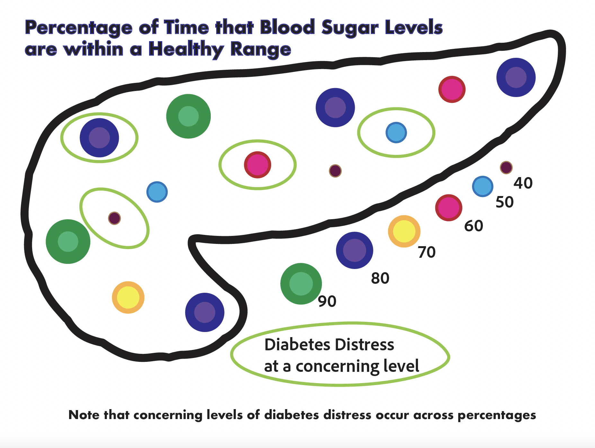

```{r setup, include=FALSE}
library(flexdashboard)
library(tidyverse)
#install.packages("plotly")
library(plotly)
library(rio)
library(here)
library(colorblindr)
library(tidytext)
library(gt)
library(psych)
```

```{r}
#dat <- import(here("pre_reg_data.csv"))
data <- import(here("reg_data.csv"))

int <- import(here("text_data.xlsx"))


my_colors <- c("darkblue","darkmagenta", "chartreuse", "cyan","tomato")
```
Background
==========


Column {data-width=400}
-----------------------------------------------------------------------

**This dashboard currently shows graphics using the data that was made public as part of the pre-registration for this study. The goal is to have 200-500 people in the study and data collection is ongoing.** 


### Demographics

```{r}

df <- data %>% 
  rename(education = edu) %>% 
  select( age, ywd, insulin, gender, education )

describe(df)
```


```{r eval=FALSE, include=FALSE}
data <- data %>% 
  mutate(int_number = case_when(
part_id == "R_cLVjYpvjfQixvpv" ~ 1,
part_id == "R_3Eyawv7ZHbUXMX8" ~ 2,
part_id == "R_1fdCp8U6J7TIpPG" ~ 3, 
part_id == "R_3nT0W62FHiaCGPg" ~ 4,   
part_id == "R_1g6IuFecvJV6n6x" ~ 5, 
part_id == "R_1mr573O3Ezhk8XJ" ~ 6,
part_id == "R_R3vFesQEw5vyUyB" ~ 7, 
part_id == "R_2TOeaDtBAd8rJgQ" ~ 8,
part_id == "R_1jTbJ73cP1sJNAX" ~ 9,
part_id == "R_2aEnOJSABPWYd6B" ~ 10))

data$int_number <- as.factor(data$int_number)


data$education <- data$edu
  

#data$int_number[is.na(data$int_number)] <- "Not Interviewed Yet"

data %>% 
  select( age, ywd, insulin, gender, education ) %>% 
  gt()

df <- data %>% 
  select( age, ywd, insulin, gender, education )

#describe(df, fast=TRUE)


```
ywd = years with diabetes


----------------------


```{r eval=FALSE, include=FALSE}
library(ggrepel)
data <- data %>% 
  mutate(int_number = case_when(
part_id == "R_cLVjYpvjfQixvpv" ~ 1,
part_id == "R_3Eyawv7ZHbUXMX8" ~ 2,
part_id == "R_1fdCp8U6J7TIpPG" ~ 3, 
part_id == "R_3nT0W62FHiaCGPg" ~ 4,   
part_id == "R_1g6IuFecvJV6n6x" ~ 5, 
part_id == "R_1mr573O3Ezhk8XJ" ~ 6,
part_id == "R_R3vFesQEw5vyUyB" ~ 7, 
part_id == "R_2TOeaDtBAd8rJgQ" ~ 8,
part_id == "R_1jTbJ73cP1sJNAX" ~ 9,
part_id == "R_2aEnOJSABPWYd6B" ~ 10))

data$int_number <- as.factor(data$int_number)

p <- data %>% 
ggplot(aes(dds_means, des_score)) + 
geom_point(aes(color = ywd), size = 5)   + 
geom_text_repel(data = data, aes( label = ywd), max.overlaps = Inf) +
  theme_bw() + 
  labs(x = "Diabetes Distress", y = "Diabetes Empowerment", caption = "mean values from validated scales", title = "Years with Diabetes: looking at distress and empowerment")

p
```


Research Question One
===========

```{r include=FALSE}
data <- data %>%
  mutate(
    across(
      # ^means begins with. 0-9 are the possible numbers and {1,2} means it 
      # could be one or two digits
      matches("^resources_[0-9]{1,2}$"), 
# need to ask Sara about what the period inside parens indicates
      ~ ifelse(is.na(.), 0, 1)))


```

```{r include=FALSE}

data$res_sum <- data %>% 
  select(resources_1:resources_21)%>%
  rowSums(na.rm=TRUE)

```


### Research Question One

```{r include=FALSE}

temp <- select(data,resources_1:resources_21) %>% 
  rename(Endocrinologist = resources_1, "Diabetes Educator" = resources_2, "Nurse Practitioner" = resources_3, "General Doctor" = resources_4, nurse = resources_5, "Physician's Assistant" = resources_6,podcast = resources_7, Instagram = resources_8, FaceBook = resources_9, TikTok = resources_10, Twitter = resources_11, YouTube = resources_12, Google = resources_13, Roommate = resources_24, "Friends without Diabetes" = resources_14, "Family live with" = resources_23, "Family don't live with" = resources_15, "Romantic Partner" = resources_25, "Other Type 1s" = resources_16, "Juvenile Diabetes Research Foundation" = resources_17, "Beyond Type One" = resources_18, "Other Non-profits" = resources_27, Websites = resources_19, Books = resources_20, Other = resources_26, none = resources_21 )

temp

txt  <- c()
  
for(i in 1:nrow(temp)){
  txt[i] <- paste(colnames(temp)[temp[i,]==1],collapse=" \n ")
}


txt

```

```{r}

fig <- plot_ly(type = 'scatter', mode = 'markers') 
fig <- fig %>%
  add_trace(
    x               = data$res_sum, 
    y               = data$des_score,
    marker = list(
      color = 'dodgerblue',
      size = 15,
      line = list(
        color = 'black',
        width = 4
      )),
    text            = txt,
    hoverinfo       = 'text',
    marker          = list(color='darkorchid'),
    showlegend      = F 

  )

fig  %>% layout(title = 'Do More Resources Mean More Diabetes Empowerment?', xaxis = list(title = 'Number of Resources a Person Uses'), 
        yaxis = list(title = 'Diabetes Empowerment Score'))

legend = list(title=list(text='<b> Species of Iris </b>'))
fig
```


Research Question Two
=================================

Column {data-width=600}
-----------------------------------------------------------------------

What is the diversity of low symptom experiences (physical sensation and the number when symptoms start and stop)?

### **Participants were asked to talk about what it feels like experience low blood sugar**


```{r eval=FALSE, include=FALSE}
data <- data %>% 
  mutate(int_number = case_when(
part_id == "R_cLVjYpvjfQixvpv" ~ 1,
part_id == "R_3Eyawv7ZHbUXMX8" ~ 2,
part_id == "R_1fdCp8U6J7TIpPG" ~ 3, 
part_id == "R_3nT0W62FHiaCGPg" ~ 4,   
part_id == "R_1g6IuFecvJV6n6x" ~ 5, 
part_id == "R_1mr573O3Ezhk8XJ" ~ 6,
part_id == "R_R3vFesQEw5vyUyB" ~ 7, 
part_id == "R_2TOeaDtBAd8rJgQ" ~ 8,
part_id == "R_1jTbJ73cP1sJNAX" ~ 9,
part_id == "R_2aEnOJSABPWYd6B" ~ 10))

data$int_number <- as.factor(data$int_number)

```


```{r}
#{.storyboard} removed this for now


dat <- left_join(data, int)


dat <- dat %>% 
unnest_tokens(word, lows)

dat %>% 
anti_join(stop_words) %>% 
  filter(word != "low",word !="yeah",word != "ago",word != "feel", word !="feeling", word != "lows", word != "describe", word != "super", word != "sugar", word != "straight", word != "start", word != "dexcom", word != "feels", word != "feelings", word != "extreme", word != "gonna", word != "guys", word != "happening", word != "started", word != "times", word != "leave", word != "lot",word != "type", word != "stuff") %>% 
count(word, sort = TRUE) %>% 
  mutate(word = reorder(word, n)) %>% # make y-axis ordered by n
  slice(1:20) %>% # select only the first 15 rows
  ggplot(aes(n, word)) +
  theme_minimal() +
    geom_col(fill = "darkorchid")+ theme(panel.grid.major.x = element_line(color = "grey",size = 0.25, linetype = 1), panel.grid = element_blank()) + labs(title = "Word frequencies in interviews", x = "Number of Times Word was Spoken", y = "Word", subtitle = "Top 20 words displayed", caption = "From first 10 interviews - transcription in progress")


```

-------------


Some Initial Findings
========================
### **Diabetes is complicated: stress from diabetes and success with blood sugar outcomes do not have a clear relationship**

```{r}

```


```{r eval=FALSE, include=FALSE}
p <- data %>% 
  ggplot(aes(part_id, percent_time_70_180)) +   geom_point(aes(size = percent_time_70_180))

p <- data %>% 
  ggplot(aes(dds_means, percent_time_70_180)) +   geom_point(aes(size = percent_time_70_180, color = percent_time_70_180))

p
data %>% 
  filter(dds_means >= 3) %>% 
  select(percent_time_70_180)

data %>% 
  filter(percent_time_70_180 >= 90) %>% #2

data %>% 
  filter(percent_time_70_180 >= 80 & percent_time_70_180 < 90) #4

data %>% 
  filter(percent_time_70_180 >= 70 & percent_time_70_180 < 80) #1

data %>% 
  filter(percent_time_70_180 >= 60 & percent_time_70_180 < 70) #2

data %>% 
  filter(percent_time_70_180 >= 50 & percent_time_70_180 < 60) #2

data %>% 
  filter(percent_time_70_180 < 50) #2
```

```{r eval=FALSE, include=FALSE}
sizep <- p + scale_size(range = c(5, 15))

sizep
ggsave("sizep.png")

sizep
```

